*Implementing block-sparse attention took a week. Making it actually pay took a
month of profiling — and the fix was moving one write address.*

At long context, most KV blocks in attention prefill end up with post-softmax
weights that are numerically negligible. BLASST
([arXiv 2512.12087](https://arxiv.org/abs/2512.12087)) is a training-free way
to skip them: during FlashAttention's online softmax, statistics you already
have tell you, per KV block, that its contribution will vanish.

:::aside[What the paper reports]
1.52× prefill speedup at ~72% sparsity.
:::

This summer at Modular I implemented BLASST in MAX's FlashAttention-4-style
SM100 (B200) bf16 prefill kernel. The skip mechanism worked within the first
week, producing exactly the sparsity you dialed in. It was also slower than
it should have been at every skip rate — +14.8% vs dense when nothing was
skippable. The rest of the project was finding out why — per-warp
`clock64` timelines and Nsight Compute. The fix is a scheduling change called
**cross-stage P** — it also makes the *dense* kernel 3.36% faster, and it
ships default-on.

We'll see that the tax is placement, not instruction count; that the missing
wins were latency the deleted work had hidden; and that one moved write
address fixes both.

## The scoreboard

One benchmark, tracked throughout; sparsity is dialed synthetically, so the
skip rate is an input. Attention-kernel time vs
dense, from the merged PR:

:::aside[The bench]
`bench_mha_sparse.mojo`: batch 2, 32 query heads, GQA group 8, head_dim 128,
seq 8192, bf16, MAG 13000, single B200. Sparsity dials via `n_buckets`
buckets of key tags: nb4 ⇒ 76% of blocks skippable, nb16 ⇒ 95%.
:::

:::aside[How each cell was measured]
Median of 7 interleaved runs, every ON-vs-OFF pair md5-witnessed — a
build-cache quirk once produced a silent OFF binary, hence the witnessing.
:::

| skip rate | BLASST alone | BLASST + cross-P | cross-P's own contribution |
|--:|--:|--:|--:|
| 0% (nb1)  | +14.8% | −0.7% | −13.5% |
| 51% (nb2) | −4.9%  | −12.8% | −8.3% |
| 76% (nb4) | −20.0% | −29.5% | −11.9% |
| 89% (nb8) | −29.0% | −37.8% | −12.3% |
| 95% (nb16)| −33.7% | −41.9% | −12.3% |

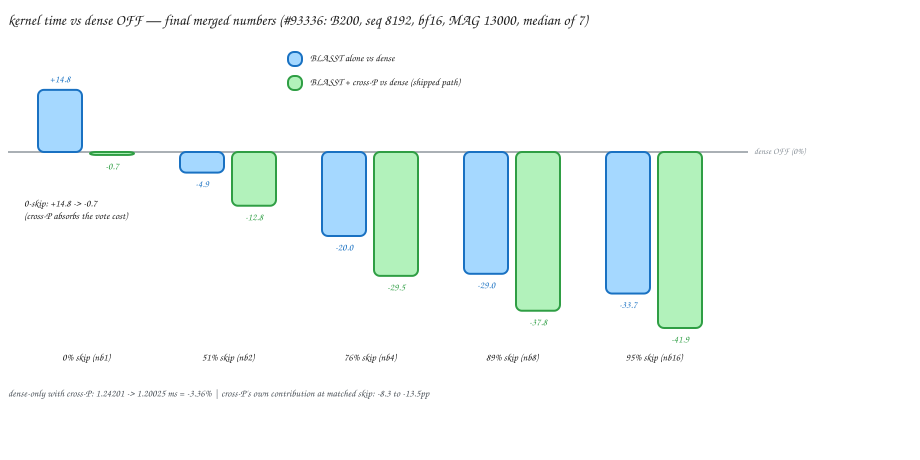

Three observations. Cross-P helps at every skip rate, by a roughly constant
amount (last column). It turns the 0-skip tax into a small net win, which is
what makes BLASST safe to leave enabled. And skip counts match at every
threshold — cross-P changes what the kernel does while deciding, not which
blocks get skipped.

At the model level (Llama-3.1-8B-Instruct), TTFT at 64K context falls 20.0%
at a threshold where RULER accuracy lands *above* the dense baseline. The
rest of the post derives this table.

## FlashAttention

Attention is matmul → softmax → matmul: scores $S = QK^\top$, weights
$P = \mathrm{softmax}(S)$ row-wise, output $O = PV$. The full score matrix is
too big to materialize. FlashAttention therefore streams K/V in blocks (128
keys per block here) and keeps three running statistics per query row: a
running max $m$ (you exponentiate $e^{x-m}$ for stability), a running sum of
exponentials $l$, and the output accumulator $O$. A *running* max creates a
correction step: when a new block raises it, prior accumulation is rescaled
by $e^{m_{old}-m_{new}}$; if the max doesn't move, the factor is exactly 1 —
a no-op.

MAX's FA4-style SM100 kernel
(`max/kernels/src/nn/attention/gpu/nvidia/sm100/`) is warp-specialized — a
pipeline of roles over KV blocks $j$:

- the load warp TMAs $K_j$/$V_j$ from HBM into shared memory;
- the MMA warp issues every tensor-core matmul: $S = QK_j^\top$ into TMEM
  (SM100's on-chip accumulator memory), and later $O \mathrel{+}= PV_j$;
- two softmax warpgroups, one query tile each — the "2Q" split — read S out
  of TMEM, take the row max, compute exp2, store P back to TMEM;
- the correction warpgroup rescales $O \times c_j$ in place.

:::aside[The roster]
w13 is the load warp, w12 the MMA warp, w0–7 the two softmax warpgroups,
w8–11 the correction warpgroup — the row labels in every timeline below.
:::

:::aside[One combined barrier]
The $O \mathrel{+}= PV_j$ issue waits on a single 256-count mbarrier:
P stored *and* O rescaled.
:::

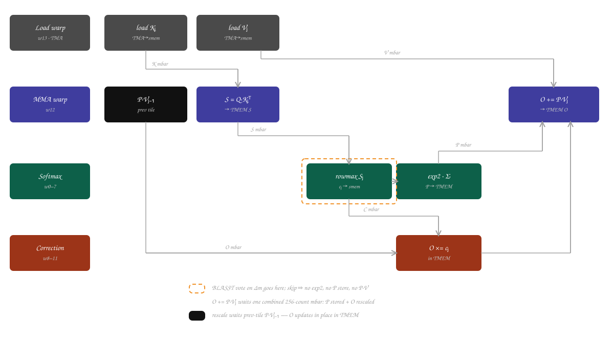

Why two query tiles? Each tile's `QKᵀ → exp2 → P·V` is a dependent chain, and
during exp2 the tensor cores would idle. The tiles share only the streamed
K/V, so each tile's exp2 hides behind the *other*'s matmuls.

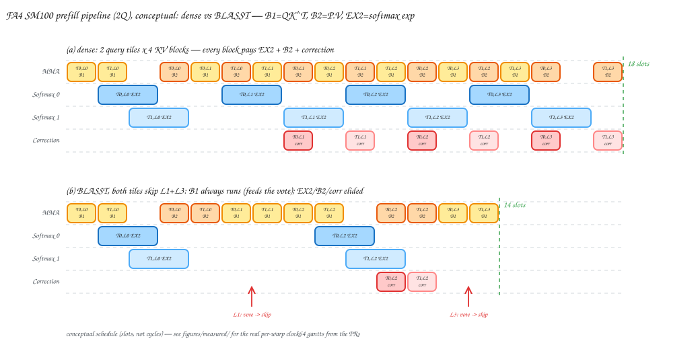

That schedule is static. BLASST empties slots out of it.

## Vote, then skip

During online softmax you already hold a block's local max $\tilde m_j$ and
the running max $m$. The BLASST rule: if

$$\tilde m_j - m < \ln \lambda$$

then every post-softmax weight in the block is at most $\lambda$ — negligible —
so its exp2, row-sum, P store, and $PV$ matmul can all go. A skipped block
never raises the running max, so its correction factor is exactly 1.0 and the
running statistics stay *exact*. One scalar $\lambda$ controls everything.

:::aside[MAG units]
In the kernel, $\lambda$ rides as a compile define in milli-log-units:
MAG 2500 means $\ln\lambda = -2.5$. Larger MAG, fewer skips.
:::

Prefill is compute-bound, so the win is the removed exp2/FP math and P·V
tensor-core work — V still gets loaded. The real kernel work is turning a
per-*row* test into a per-*block* skip: exp2 and P·V execute collectively,
128 rows per warpgroup, one monolithic matmul. The test also needs a *true*
running max, so a second one exists solely for the vote — the kernel's own is
lazy.

:::aside[Decode is a different win]
Decode is memory-bandwidth-bound; the shipping decode kernels additionally
gate the V load from HBM — bytes, not FLOPs. This project is the prefill
side.
:::

:::aside[The lazy max]
An optimization lets the kernel's row max lag the true max by up to $2^8$
before rescaling. Feeding it to the threshold would silently shrink the
effective $\lambda$ by up to 256×. The lazy one still drives exp2, as before.
:::

As landed:

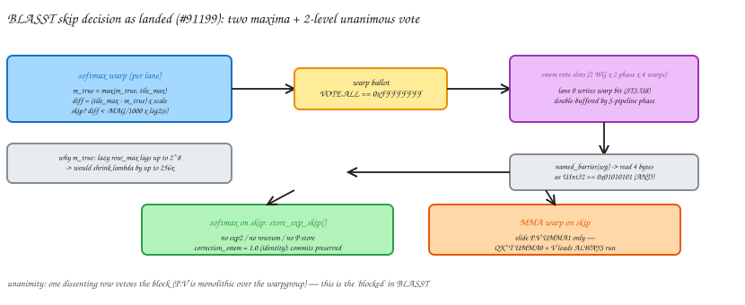

- **Warp ballot, vote-ALL.** Each lane tests its rows; `VOTE.ALL` ANDs 32
  lanes in one instruction. One row that wants the block vetoes the skip —
  that unanimity is the "blocked" in BLASST.
- **Warpgroup unanimity via smem.** Lane 0 of each warp publishes its bit to
  a shared-memory slot; after a warpgroup `named_barrier`, all 128 threads
  read the four bits back; the skip needs unanimity.
- **On a skip.** A stripped `store_exp_skip` runs — no exp2, no row-sum, no P
  store, correction written as identity — and *every* mbarrier arrival is
  preserved so the pipeline never desynchronizes. The MMA warp elides only
  the P·V. $QK^\top$ and the V loads always run: the scores feed the decision
  itself, which also caps prefill speedup near 1.8× regardless of sparsity.

:::aside[The vote slots]
A 16-byte shared region — 2 warpgroups × 2 pipeline phases × 4 warps,
double-buffered. The readback is four bytes as one `UInt32 == 0x01010101`.
:::

:::aside[One-tile skips]
The two tiles vote independently and the schedule is static, so wall-clock
compresses when *both* tiles skip a block; a one-tile skip mostly becomes a
bubble. Realized speedup tracks *correlated* skipping, not raw skip count.
:::

:::aside[Opt-in wiring]
The feature is opt-in (`ENABLE_BLASST`), and a serving hook injects the
compile defines per session — no rebuild.
:::

The scoreboard says the sparsity arrived and the time didn't; seeing why
takes instruments.

## The instruments

Per-warp `clock64` timelines: gated instrumentation stamps every warp's step
boundaries; one recording CTA's stamps render as a gantt: one row per
warp, one colored span per step.

:::aside[Reading the gantts]
Rows: w0–3 softmax tile A, w4–7 tile B, w8–11 correction, w12 MMA, w13 load.
Per softmax warp each block renders as light-blue *wait* (idle until S
arrives), dark-blue *A1/B1* (score read-out + row-max), orange *A2/B2*
(exp2 → P), and a pink *A3/B3* store sliver. With BLASST on: purple *DEC*
(the vote) and pale-orange *skipped* blocks. On the MMA lane, green is P·V
wait/issue and a red tick a skipped P·V.
:::

:::aside[Capture config]
The captures below: seq 2048, batch 1. DEC spans the full vote:
max-reduce → publish → warpgroup barrier → resolve.
:::

The instrument perturbs what it measures and is only common-mode within one
build. So the standing rule: gantts for structure, NCU and md5-witnessed
benchmarks for magnitudes.

:::aside[When the instrument lied]
In one cross-build comparison the instrumented span moved −8.5% while the
real benchmark moved +1.4%. An instrument that isn't common-mode across the
diff doesn't get a vote.
:::

:::aside[Dilation self-check]
PR-stated caveat for the gantt pairs below: the dense pair passes its
dilation self-check; the nb4 pair fails it — read shapes, not lengths.
:::

Nsight Compute (base clocks, matched md5-witnessed binaries) frames
everything with its first result. Dense at 64K context: SM compute throughput
89.6% of peak, memory not the constraint — the kernel is compute-bound.

:::aside[Pipe-level detail]
Dense, 64K (NCU): tensor pipe ($QK^\top$) 87%, exp2/FP pipe 66%, memory SoL
32.5%, L2 hit rate 99.1%.
:::

At 94% skip, exp2 instructions fall 93.8% while TMEM score reads (`LDTM`)
stay byte-identical — BLASST wins by deleting the pacing compute. The problem
was everything around it.

:::aside[At base clock]
Wall-clock at 94% skip: −23% in the base-clock NCU runs.
:::

## Evidence, part 1

Dense, everything off:

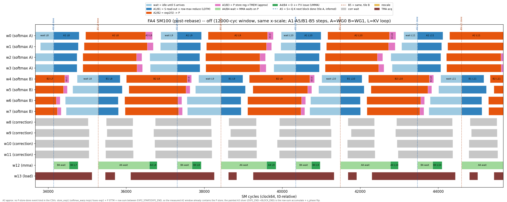

Two readings. Exp2 (orange) is the long pole on the softmax lanes —
consistent with NCU. And every block on every softmax warp begins with a
light-blue wait for scores. In steady state, S lands roughly 800
cycles *after* the previous block's exp2 ends — early on 0 of 62 measured
blocks. Scores are always just-in-time. Dense doesn't much care; the wait
hides behind other work.

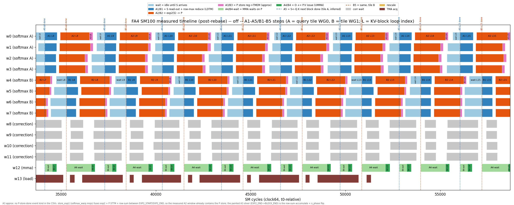

Now BLASST at 76% skip (nb4), no cross-P:

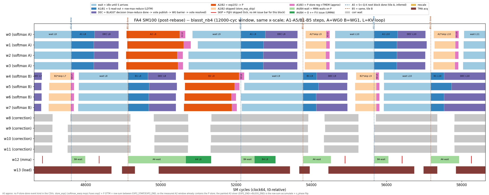

The machinery works: purple DEC spans follow each A1, skipped blocks collapse
to pale slivers, red ticks mark elided P·Vs. But light blue now dominates the
softmax lanes. The kernel deleted most of its exp2 and turned much of the
saving into waiting. A skipped block runs wait → A1 → DEC → skip, and the
wait is the biggest piece.

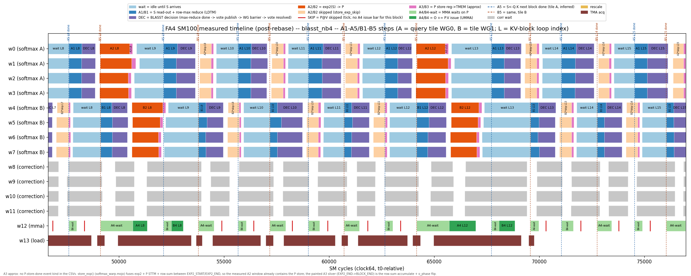

Two questions remain, and they share an answer. Why does BLASST
cost +14.8% when *nothing* is skipped? And why does deleted work turn into
waiting instead of wall-clock time?

## The 0-skip tax

The 0-skip question first; NCU answers it definitively. The vote adds
instructions on the softmax lanes. The obvious hypothesis: too many of them.
So I deleted some — a cleanup collapsed the tile-max reduction from two full
fragment reductions to one, removing 3.10M max-family instructions, the
single largest adder. Cycles moved 0%. The instruction count fell, CPI rose
to compensate, and their product held constant to three decimals. The
instructions were free.

:::aside[The vote's instruction bill]
Max reduce, subtract-compare, ballot, smem write, barrier, readback — each
roughly +1.03M executed instructions: 8 softmax warps × 63 blocks × 2048
CTAs.
:::

:::aside[Same tax, two kernels]
These sessions ran on the pre-rebase kernel, where the tax measured ~15.7%
(+15.65% → +15.74% across the deletion, within cross-session variance);
+14.8% is the same tax on the final shipped code. Instruction overhead fell
+4.1% → +3.6%.
:::

The cost is *where they sit*: the decision chain

```
LDTM (read S) → max reduce → compare → warp vote → smem write
             → WG barrier → readback → branch
```

executes serially between the score read and exp2, on the softmax critical
path — roughly 712 cycles per block (instrumented captures). NCU's stall view
agrees: the dominant delta is `long_scoreboard` where the lengthened chain
resolves — the vote *exposes* a pre-existing UMMA→S-read latency that used to
hide.

:::aside[Sympathy stalls]
The stalls pile on the softmax loop-header branch. Occupancy sits at 21.5%,
and correction- and load-warp waits grow in sympathy.
:::

So where does the tax sit? Mostly in score arithmetic on the exp2 path —
about 8.6 points of the ~14 (bench-isolation decomposition, figure), not
coordination.

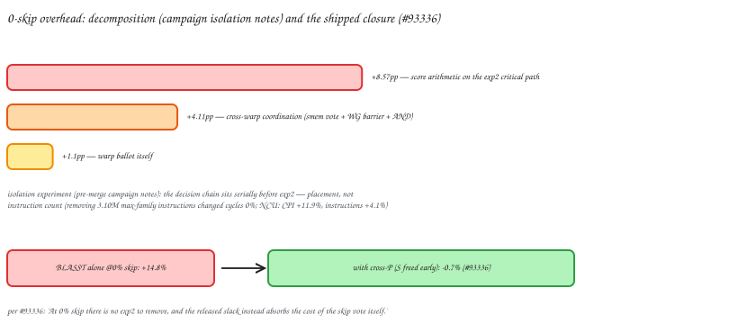

I falsified the cheap fixes one by one:

| Lever | Result |
|---|---|
| Delete the redundant reduction (−3.10M instr) | perf-neutral — the instructions were latency-hidden |
| Drop the warpgroup barrier (per-warp strips, zeroed P) | recovered ~1.1pp of ~14; *raised* break-even to ~47% skip |
| Skip only the P·V, leave softmax alone | +8.5% *slower* at 75% skip — P·V was never on the critical path (~2.3%) |
| Offload the decision to the idle correction warps | dead on inspection: correction wakes at the same S-ready signal — no head start |

The note I wrote at the time: an on-critical-path decision bottoms out around
+8–10% no matter how much coordination you shave. To get the paper's
"0-sparsity ≈ free," the decision must leave the critical path — or the path
must move.

## Why the waits stay

So what's keeping the scores late? The gantt already showed it: scores are
late *by construction*.

TMEM is fully budgeted, so P has nowhere of its own; by default each tile's P
overwrites its own S region. P holds S hostage: the buffer can't accept block
$i{+}1$'s scores until block $i$'s P, in the same columns, has been stored
*and* consumed by P·V. If we trace one tile:

```
QK(i) → read S(i) → exp2 → store P(i) over S(i) → P·V reads it → only now QK(i+1)
```

:::aside[The TMEM budget]
512 columns: S0 and S1 (each tile's scores, 128 columns each) plus O0 and O1
(the accumulators).
:::

The next score matmul is chained, transitively, behind this block's exp2, P
store, and P·V. That's why S always lands just-in-time. Dense mostly gets
away with it — exp2 is long enough to cover the chain. But BLASST *deletes*
exp2, and what remains on a skipped block is exactly what the chain gates:
waiting for scores, then a vote about them. The skip removes the work that
was hiding the latency and keeps the latency.

The same chain explains the 0-skip tax's stubbornness — the vote sits inside
the one serial dependency with no slack — and predicts the fix. Nothing about
the decision needs to change. The S buffer must be free the moment its scores
are read out, so the next QKᵀ can start underneath everything else. P needs
to go somewhere else. There is no spare TMEM. But there are the sibling's
columns.

## Cross-stage P

Where can P go? P is bf16, so a 128-wide P row packs into 64 of an S region's
128 f32-sized columns — and after readout, an S region is dead data.
Cross-stage P changes only where P is written: tile A's P goes into tile B's
S region and vice versa (`S0[0:64) = P1`, `S1[0:64) = P0`, upper halves
stale).

:::aside[Lineage]
The placement is a port from
[FlashInfer's](https://github.com/flashinfer-ai/flashinfer) native SM100
kernel onto MAX's FA4 structure.
:::

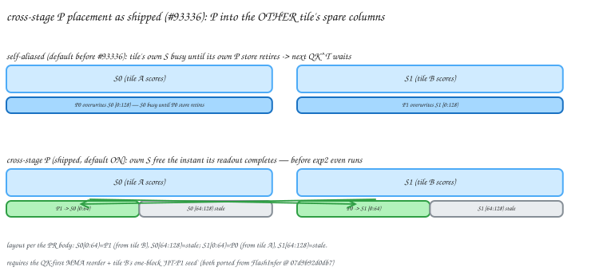

Now a tile's score buffer is free the instant readout completes — before exp2
even runs — so the next score matmul starts right away. The exp2/store/P·V
tail runs *beside* the next QKᵀ instead of in front of it.
Moving one address breaks an implicit safety net, so three things move with
it:

- **The MMA issue order goes QK-first.** The default order put each tile's
  next QK behind its own P·V in program order — that *was* the
  write-after-read fence protecting P. Both score matmuls now issue first,
  each QK gated by a cheap "softmax finished reading S" mbarrier instead of a
  full P drain.
- **A JIT-P1 seed.** One hazard survives: tile B's P now lives in S0, and QK0
  is the *first* op of the next iteration — it would clobber P1 before its
  P·V read. The fix makes tile B's store *late* rather than guarded:
  warpgroup B consumes one extra "window free" token before its main loop — a
  one-block head start, so its store lands after the next QK0's scores are
  read out. Both pieces — order and seed — come from FlashInfer.
- **A tuned store schedule.** P can only be stored once the sibling's window
  is free (an `inplace` handshake), so each tile buffers some exp2 output in
  registers to cover the gap. An exhaustive md5-witnessed sweep: buffer
  *nothing* and the store stalls on the flag (+5.99%); buffer *everything*
  and exp2 stops overlapping the stores (up to +11.44%). Shipped: tile B
  fully fused — its window frees before its exp2 even starts, thanks to the
  half-period stagger — and tile A buffers a quarter.

BLASST plugs in unchanged: the skip path consumes its handshake token per
block even when storing nothing, keeping the pipelines in phase.

I had built this exact mechanism three weeks earlier and measured a loss:
+1.44% on dense, the intended "S arrives early" gain ≈0. The post-mortem also
found a real race in its cross-warpgroup handshake — isolated launches
verified 12/12; back-to-back launches failed about 1 in 5. I archived the
diff and wrote "falsified." Then an unrelated MMA-layout rewrite landed on
`main` and changed the kernel's latency-hiding shape. Re-measured on top of
it, the identical placement was a clear win; retuned (the sweep above), with
depth-4 handshake pipes, it shipped. The lesson, verbatim from my notes:
*"'inherent' verdicts are relative to a kernel shape — re-test falsified
levers after major upstream rewrites."*

:::aside[The race, in detail]
The first handshake used depth-1 pipes and a peek-less blocking wait. Under
heavy instrumentation (NCU replay, racecheck) the kernel wedged outright —
which is how the race was found at all. The 25×/10× back-to-back launch
soaks in the verification suite date from this; single-launch verification
had let it through.
:::

## Evidence, part 2

Cross-P alone, dense inputs, BLASST off:

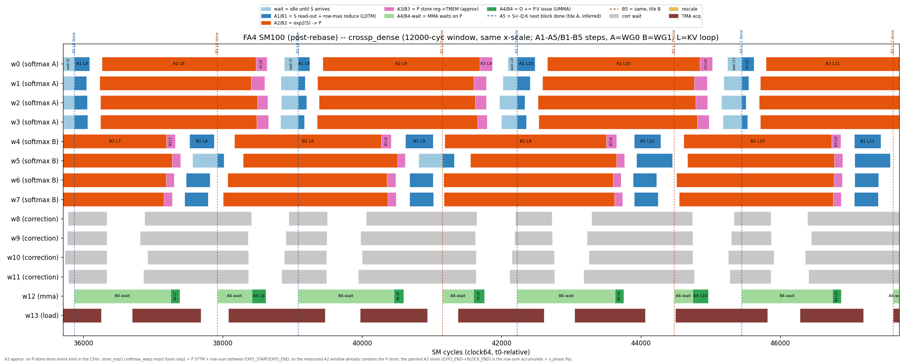

Same axes as the dense baseline: the light-blue waits have all but
disappeared — the next block's scores are computed underneath the current
block's softmax, exactly the slack the layout was supposed to buy.

:::aside[Reading tile A's span]
Tile A's orange span *measures* longer here because the instrumented exp2
window now contains the buffered P-store drain — the gantts-for-structure
rule again; the clock says −3.36%.
:::

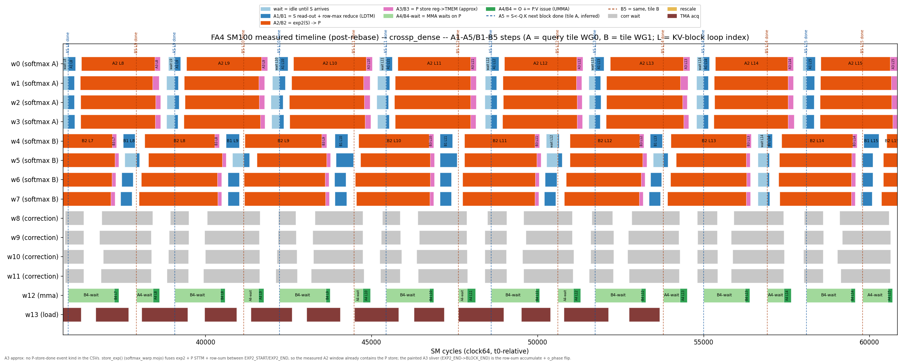

On the bench: 1.24201 → 1.20025 ms, −3.36% on dense — which is why cross-P
ships default-on, BLASST or no. The NCU matched pair reads as a pure
scheduling win — the same matmul work, packed tighter.

:::aside[The dense matched pair]
Tensor-pipe utilization 79.6% → 84.2%; instructions +4.13% while cycles fall
4.80%; MMA instruction count bit-identical (4,194,304).
:::

And both together — BLASST nb4 + cross-P:

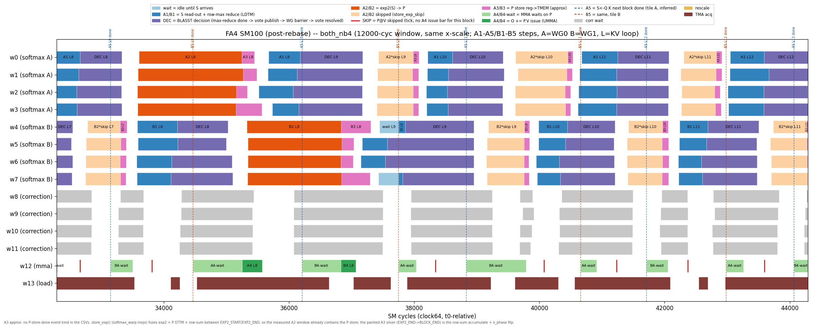

Against the BLASST-alone gantt: same DEC spans, same skip slivers, same red
ticks — the vote is untouched — but the light blue is gone. Skipped blocks
run A1 → DEC → skip back-to-back, and visibly more KV blocks fit in the same
12,000-cycle window.

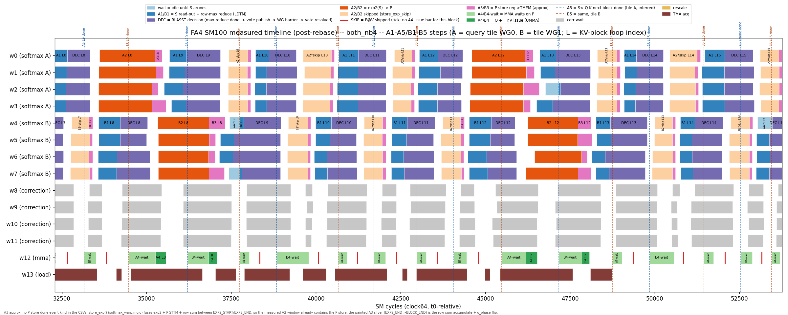

Why does cross-P help *more* under BLASST than on dense — −12% vs −3.4%? On
dense, exp2 still dominates, so early scores mostly convert waiting into
slack. With skipping, exp2 is deleted and score latency *is* the critical
path — precisely what the early release shortens.

:::aside[NCU at 76% skip]
Tensor pipe 61.5% → 69.6%, long-scoreboard stalls −30%, mio-throttle −12%,
registers flat at 128/thread, zero spill.
:::

At 0% skip there is no exp2 to remove, so the released slack simply
absorbs the vote chain: +14.8% becomes −0.7%. The tax is gone.

## From kernel to model

Does any of this survive end to end? Attention is only part of prefill —
TTFT gains are diluted by unchanged MLP, norm, and embedding work — and
accuracy decides whether any of it ships. Setup: Llama-3.1-8B-Instruct,
bf16, single B200.

:::aside[Eval protocol]
RULER: 13 tasks × {4K…64K}, 130 samples per task. TTFT: an isolated single
request, median of 10, fresh server per point.
:::

| MAG | RULER avg | RULER 64K | TTFT 4K Δ | TTFT 64K Δ |
|--:|--:|--:|--:|--:|
| dense | 81.9 | 78.5 | ref (44.3 ms) | ref (1194 ms) |
| 14000 | 81.9 | 78.5 | −0.5% | +3.8% |
| 10000 | 81.7 | 77.4 | +1.1% | −4.1% |
| 7000  | 82.6 | 78.2 | −2.7% | −8.6% |
| 4500  | 82.2 | 77.7 | +2.5% | −13.7% |
| 2500  | 82.7 | 75.2 | −3.8% | −20.0% |
| 1500  | 79.6 | 69.6 | −4.3% | −20.9% |
| 1000  | 71.8 | 58.2 | −6.8% | −21.9% |

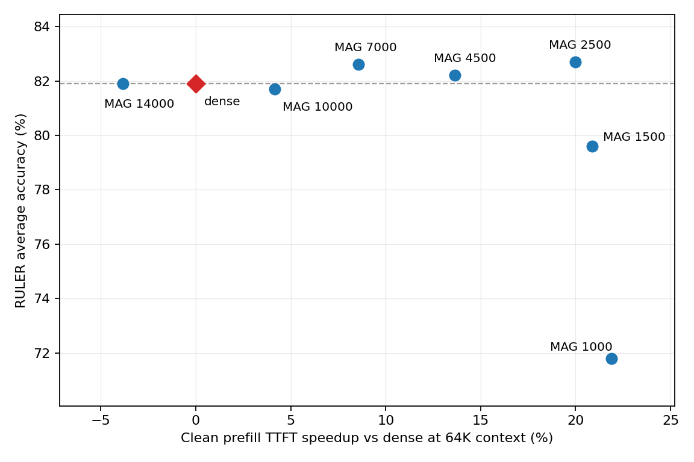

Accuracy holds from the strictest threshold down to MAG 2500, which posts the
best average — above dense — while cutting 64K TTFT by a fifth. Below MAG
1500, accuracy falls off a cliff, long context first.

It's a long-context lever: at 4K the deltas sit within a few percent either
way — nothing worth skipping — and the win grows with context. Too
conservative is also wrong: MAG 14000 is *slower* than dense at 64K, because
nothing clears the threshold and the vote runs with nothing to remove.

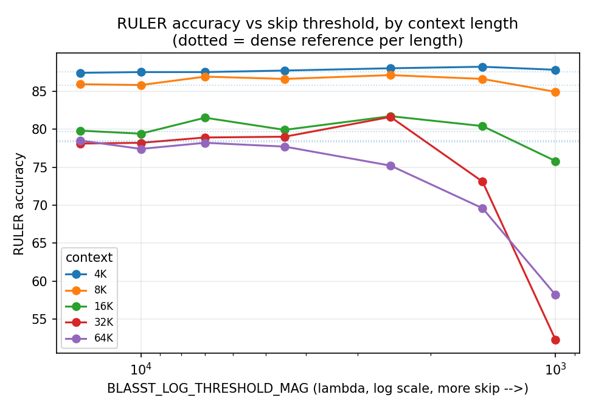

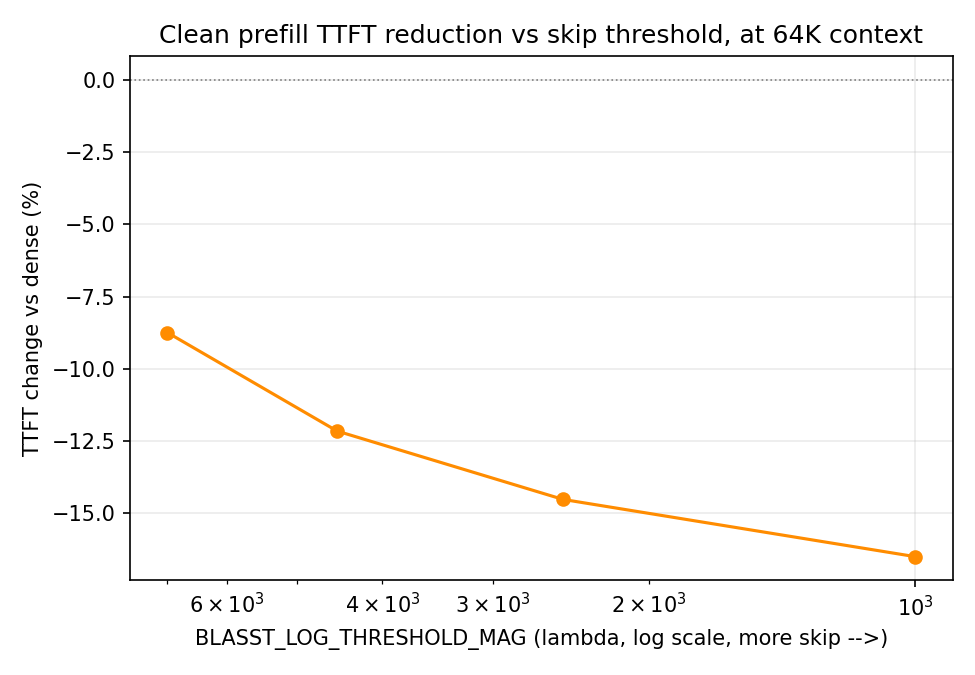

The PR recommends MAG 2500 (best average) or MAG 4500 (64K-lossless, table
above).

:::aside[Absolute RULER]
Our *absolute* RULER (~82 avg) sits below the paper's ~93 for this model — a
serving-harness fidelity gap, same harness for dense and every λ, so the
relative comparison stands. The absolute gap is tracked separately.
:::

## Trusting the numbers

Sparse-attention kernels fail quietly — plausible-but-wrong outputs, races
that only show under load — and this project ate one such race early. Every
number rides a stack of gates: bit-exact reference agreement, launch-pressure
soaks, sanitizer-clean runs, md5-witnessed ON-vs-OFF pairs. Disabled, BLASST
cannot perturb the shipping kernel: the OFF build is byte-identical (md5).

:::aside[The gates]
Bit-exact verify at awkward shapes (T = 5/8/63/127; num_keys
512/8064/16256); skip counts match the dial exactly, with a differential
golden confirming cross-P changes no decision; compute-sanitizer synccheck
and racecheck clean; NCU always on matched clock-locked pairs.
:::

## Where I landed

BLASST ships opt-in; cross-stage P ships default-on. Together on the FA4
SM100 bf16 prefill kernel: −41.9% attention-kernel time at 95% skip, −0.7% at
0% skip, and −20% TTFT at 64K with RULER accuracy above the dense baseline.

:::aside[The raw evidence]
Gantt CSVs, capture scripts, NCU tables, and provenance are in a
[public gist](https://gist.github.com/yashagar-cmu/252090c98f59a3057f23ca9968331135).
:::

Two lessons cost the most. Count cycles, not instructions: deleting 3.10M
instructions moved cycles 0%. The tax was placement — a short chain in the
wrong place beats a long chain in the right one. And falsified is a property
of the baseline: the same cross-P mechanism measured a loss in July and a win
in August, separated by an upstream rewrite. Re-test your graveyard. The
third generalizes: a skip optimization is a latency-hiding audit — whether
removed work becomes wall-clock depends on what it was hiding. The gantt
showed what no counter did.

One item stays open: the absolute-RULER gap against the paper's scores —
presumably serving-harness fidelity; the relative comparisons stand either
way.

Thanks to Modular for giving "the skip works but the speedup is missing" the
weeks it needed, and to my mentor Chris Elrod, who runs GPUs in his head.

If your attention kernel is about to grow a skip path, move the decision off
the critical path first, and budget as much time for the schedule as for the
math. And if you've measured an in-path vote that came out free at 0%
sparsity, I'd like to see it.
