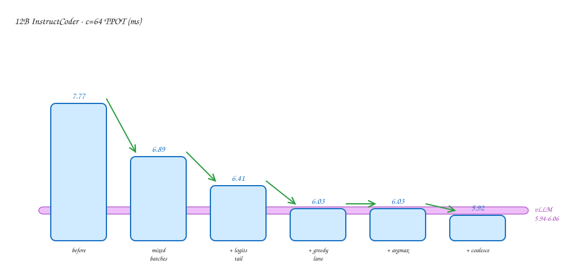
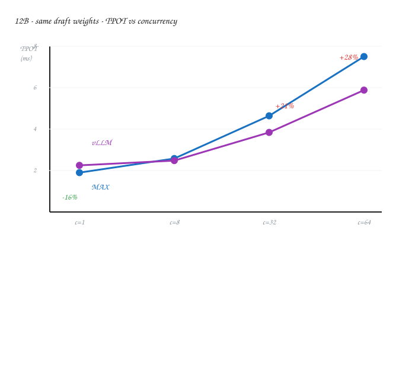
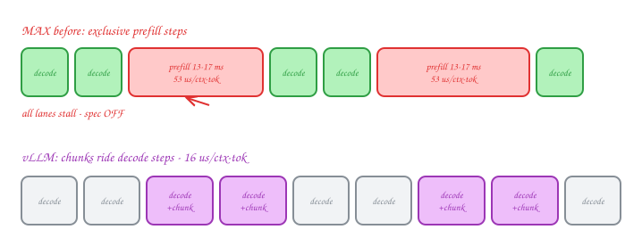
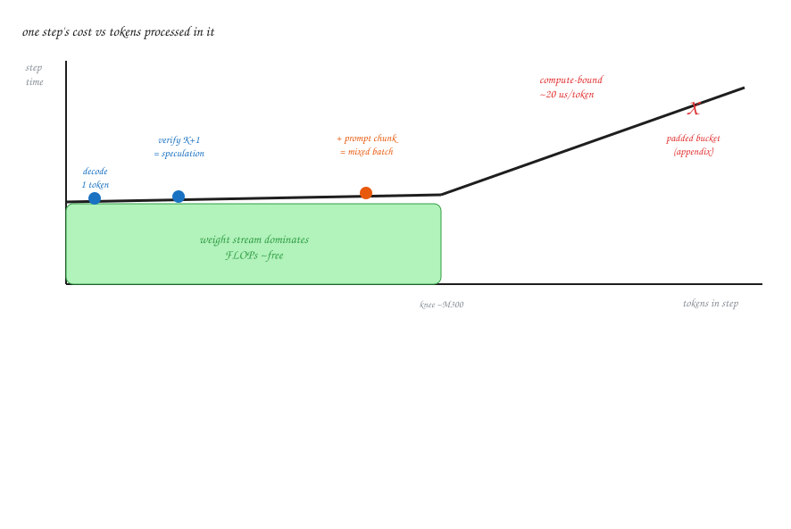
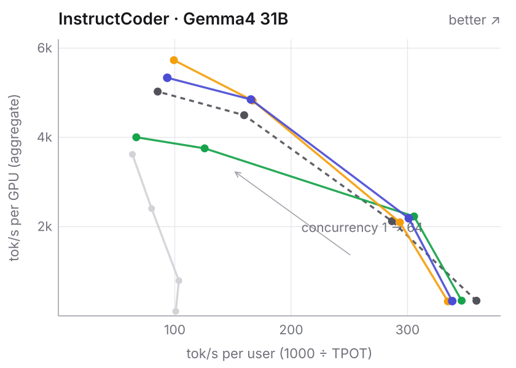
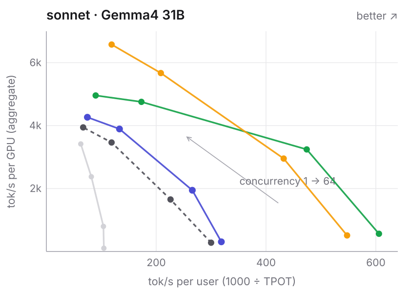
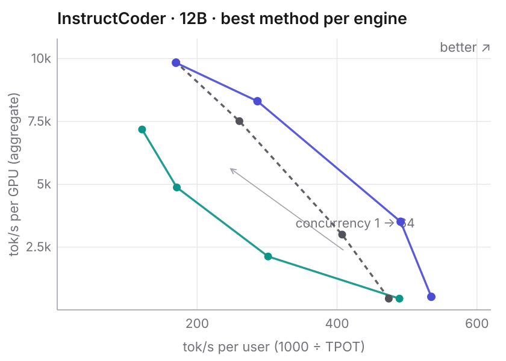

*From 30% behind vLLM under load to outside its latency/throughput curve on
every dataset at concurrency 8 and 64 — an optimization worklog from my
summer building speculative decoding for Gemma4 on one B200.*

When we first benchmarked DSpark speculative decoding for Gemma4-12B on
Modular's MAX against vLLM — identical drafter weights on both engines — MAX
won at concurrency 1 and lost under load: about 23% slower per token at
concurrency 32, 30% at 64. The obvious first guess, ours included, was that
our GPU kernels must be slow at large batch sizes.

That guess was wrong. We'll see that our kernels were already faster than
vLLM's; that the cost was prompt scheduling, at four times vLLM's price per
prompt; that folding prompts into decode steps and a four-kernel pass closed
most of the gap; and that coalescing prompt arrivals flipped the last cell.
Speculation itself is worth up to 4.0× per token over not speculating.

## The scoreboard

One cell tracks the whole campaign: Gemma4-12B, the InstructCoder
code-editing dataset, concurrency 64, mean time per output token (TPOT, ms —
lower is better). This is the cell where we started 30% behind.

:::aside[The rig]
One NVIDIA B200 (183 GB), greedy sampling, fixed seed, fixed-work runs,
vLLM 0.26.0. The full comparison conditions are spelled out in
[the boards](#the-boards).
:::

| step                                   | ms/token | vs vLLM (5.94–6.06) |
| -------------------------------------- | -------: | ------------------: |
| where we started                       |     7.77 |         ~30% behind |
| mixed prefill+decode batches           |     6.89 |              behind |
| + logits-tail kernels (softmax/argmax) |     6.41 |              behind |
| + all-greedy sampler lane              |     6.03 |            at range |
| + drafter argmax (small at this cell)  |     6.03 |            at range |
| + prompt coalescing                    |     5.92 |            below it |

The final 5.92 ms sits under vLLM's 5.94–6.06 across repeated runs, ranges
not overlapping — vLLM's best run loses to our worst here. Each row was
picked by a measurement before it was built. The back half of the post walks
the rows in order. First, the thing being measured.

## What DSpark is

A language model generates one token at a time, and each token requires
reading every weight out of GPU memory — tens of gigabytes per step for a
31B model. Decode is memory-bound; the math units sit idle while the weights
stream past. That idle arithmetic is the resource we spend for the rest of
the post. Speculative decoding spends it on guessing: a small "drafter"
guesses several tokens ahead and the target checks them all in one step.
Checking 8 tokens reads the same weights as generating 1; wrong guesses are
discarded, and output is identical to not speculating.

The accounting that runs through this post: per-token latency = step time ÷
tokens produced per step. Every fix below improves one of those two terms.

*Figure 1 of the DSpark paper
([arXiv:2607.05147](https://arxiv.org/abs/2607.05147), DeepSeek-AI) — the
architecture and decoding cycle.*

DSpark is DeepSeek's drafter design, introduced in
[*DSpark: Confidence-Scheduled Speculative Decoding with Semi-Autoregressive
Generation*](https://arxiv.org/abs/2607.05147). Three things distinguish it:

1. **It taps the target's hidden states.** The drafter — roughly a billion
   parameters on a frozen target — reads hidden states from several of the
   target's layers, plus the token embeddings. That head start is why ~1B
   can usefully track 31B: roughly 3 accepted tokens per step on code.
2. **It is block-parallel.** It guesses all K=7 future positions in one
   forward pass, holding unknown slots with MASK tokens, so drafting cost is
   roughly flat in K (EAGLE-style drafters run once per guessed token).
3. **Chaining is cheap.** Turning scores into an actual 7-token chain is a
   low-rank bias keyed on the previous chosen token, then an argmax — a
   handful of cheap GPU ops.

:::aside[The confidence head]
The checkpoint also ships a per-guess acceptance-probability head that no
serving engine uses today. It returns in the closing section.
:::

For contrast, the other methods here: **MTP** attaches a tiny drafting head
inside the target itself (cheapest possible step, sequential in K). **DFlash** is another block-parallel drafter that reads the target's
attention cache directly. All three share MAX's verification machinery.

The targets are Gemma4-12B and Gemma4-31B; every drafter checkpoint is
published.

:::aside[The checkpoints]
Targets: [google/gemma-4-12B-it](https://huggingface.co/google/gemma-4-12B-it)
and [google/gemma-4-31B-it](https://huggingface.co/google/gemma-4-31B-it)
(262,144-token vocabulary). Drafters: DeepSeek's
[dspark_gemma4_12b_block7](https://huggingface.co/deepseek-ai/dspark_gemma4_12b_block7)
for 12B, Red Hat's
[gemma-4-31B-it-speculator.dspark](https://huggingface.co/RedHatAI/gemma-4-31B-it-speculator.dspark)
for 31B. The DFlash arm runs
[z-lab/gemma-4-31B-it-DFlash](https://huggingface.co/z-lab/gemma-4-31B-it-DFlash).
:::

:::aside[Speculators format]
The 31B drafter ships in vLLM's *speculators* format — a 5-layer draft
predicting over a reduced 32k vocabulary mapped into the full one.
:::

## Correctness, then 1.3×

Milestone one was correctness: a new MAX architecture for the unified
target+draft graph — weight adapters, chaining head, acceptance
verification
([public commit](https://github.com/modular/modular/commit/cbb6488293e4)).
On ShareGPT chat at concurrency 1 it delivered 317 vs 129 tok/s over the
unaccelerated target (2.45×), accepting 2.23 of 7 drafts per step.

The first perf campaign
([public commit](https://github.com/modular/modular/commit/4f1f28f4992e))
landed three slices, judged together:

| slice                                    | kernel effect                             | e2e alone |
| ---------------------------------------- | ----------------------------------------- | --------- |
| device graph capture (record/replay)     | removes ~9.85 ms/step host-launch floor   | +5.2% c=1 |
| multi-row GEMV for the chaining head     | 258 → 31 µs/call (8.4×), 0.52 → 5.21 TB/s | ~0        |
| streaming argmax (replaces top-k K=1)    | 41 → 5.9 µs (6.95×)                       | ~0        |

Those two "~0"s are the load-bearing lesson. The decode step was
`max(host-launch floor, GPU work)`, and the two terms sat at 9.85 vs
9.71 ms — within 0.15 ms. Each kernel fix alone lowered a term that was not
binding, and measured as a null. Merged with capture, the step fell
9.90 → 7.62 ms and now tracks its own GPU-busy time to within 0.05 ms. Judged serially, both kernel wins would
have been reverted as failures.

Campaign result: +31.6% at concurrency 1 on ShareGPT (309.7 → 407.5 tok/s),
and 2.44× → 3.21× over the unaccelerated target, both arms capturing.

So why was the chaining-head GEMV slow? Not bandwidth: the library launched
262,144 one-warp blocks, and kernel time was grid size ÷ dispatch rate.
Packing several rows per warp fixed it, bit-exact.

:::aside[The dispatch ceiling]
The chip's CTA scheduler starts blocks at a fixed ~1 per nanosecond, which
made the kernel's runtime invariant to SM clock — the observation that ruled
bandwidth out.
:::

And `argmax` had lowered to a top-k K=1 path that copied the entire 524 KB
row and heap-scanned it on 8 of 148 SMs; a streaming (max, index) pass
replaced it.

:::aside[Tie-breaking]
The streaming pass is the shape every major engine uses, and it resolves
ties to the lowest index, matching NumPy. The old path did not.
:::

One planned slice died: top-M pruning of the chaining head, ranked the #1
lever before measurement, measured net-negative (−5.6% tok/s, acceptance
−0.044).

:::aside[Why it died]
It rode a slow K>1 top-k path, and the GEMV fix had cut the cost it existed
to remove by 8× while its own overhead stayed put. A lever's value depends
on the tree it lands in, so we re-ranked after every landing.
:::

We also tore down the one public prior-art datapoint,
[Makora's "Reading the future with Gemma 4"](https://www.makora.com/blog/reading-the-future-with-gemma-4)
and their Apache-2.0
[checkpoint](https://huggingface.co/makora-ai/gemma4-26b-a4b-dspark). The
stealable idea was the reduced 32k draft vocabulary, which the 31B
checkpoint we served next has natively.

:::aside[Makora's kernel idea]
Flash-decoding-style split-KV on the verify shape — an occupancy hole we
share in worse form (13 of 53 attention launches per step run 2 CTAs on 148
SMs), but capped at ~9% of our step time. Their drafter targets the 26B MoE
model, is not swappable, and its published acceptance, once domains are
matched, is not better than ours.
:::

## Scaling to 31B

The 31B bring-up
([arch](https://github.com/modular/modular/commit/345c447fd062), plus
[thinking-phase and structured output](https://github.com/modular/modular/commit/0a09195b4194))
started at 178 tok/s at concurrency 1 on ShareGPT — 2.27× better per-token
latency than the unaccelerated target, both eager. Three compounding levers
followed:

| lever | measured | note |
| ----- | -------- | ---- |
| [NVFP4 target weights](https://github.com/modular/modular/commit/ad18d875adad) (4-bit — halves the weight stream) | 1.21× TPOT (6.39 → 5.19 ms) | acceptance flat (−0.44%): drafting from quantized hidden states didn't hurt |
| [FP8 KV cache](https://github.com/modular/modular/commit/409a09a52d42) | −6.1% TPOT c=16, flat c=1 | KV pool 74.9 → 59.9 GiB = 1.475× the tokens; a capacity lever |
| [device graph capture](https://github.com/modular/modular/commit/895e0371e28a) | −20.4% TPOT c=1, −9.1% c=16 | replay the recorded step, skip launch overhead |

Capture also surfaced a crash under sustained concurrency-16 churn; the
root cause was a real kernel bug: a NaN draft logit made ArgMax return its
reduction-identity sentinel *as data*, which then indexed a gather out of
bounds. Two public kernel fixes came out of it.

:::aside[The two fixes]
[Stop ArgMax/ArgMin leaking an out-of-range index on NaN rows](https://github.com/modular/modular/commit/b41a82ec1cc8)
and
[stop a NaN from hiding a row's real maximum in TopKHeap](https://github.com/modular/modular/commit/75cd6bf39b50).
:::

I also brought up DFlash for 31B on the same machinery
([commit](https://github.com/modular/modular/commit/fb6b8c682061)) —
turning one method's benchmark into a three-way comparison.

## Losing a fair fight

With three methods on one engine, which is best? First, a K-sweep (K =
tokens drafted per step): K ∈ {3, 4, 5, 7} across ShareGPT and the
decode-heavy sonnet workload at concurrency 1 and 16. No K beats K=7 on any
workload at c≤16; DSpark's K is capped by the drafter's *trained* width of
7, not by economics.

:::aside[Slot economics]
Fixed work, measured noise floor under 0.7%. A draft slot costs
~0.04–0.06 ms (~0.4% of a step) at concurrency 1, and slots 4/5/6/7 clear
break-even by 15×/11×/7×/4.5×. At c=16, slot 7's margin thins to ~1.1× —
dynamic or shorter K starts to pay just above c=16.
:::

Then the cross-method comparison — sonnet, concurrency 1:

| method      |  step ms | tokens/step |  TPOT ms |
| ----------- | -------: | ----------: | -------: |
| DSpark K=7  |     11.6 |        3.62 |     3.20 |
| MTP K=5     |     12.2 |        5.54 |     2.20 |
| DFlash K=15 |     16.8 |        ~7.4 |     2.27 |

DSpark has the cheapest step of the three and still loses — the deficit is
more than 100% in tokens per step. DFlash overcomes a 45% step-cost handicap
purely with block length: verification is nearly width-invariant, so the
cheapest tokens are the ones a wider-trained drafter would add. Neither
acceptance rate nor step cost is the metric; tokens per step ÷ step cost is.

:::aside[Width is nearly free]
Verifying 8 rows instead of 4 costs under 1% of the step.
:::

:::aside[Per drafted token]
Per *drafted* token DSpark is ~2× cheaper than MTP (flat vs linear in K) —
it just drafts too few. On ShareGPT the matchup is a wash: DSpark's
tokens/step is higher, 2.97 vs 2.85.
:::

The fix is known but doesn't exist yet: a block-16 DSpark checkpoint, which
by the slot economics would land around TPOT 1.6–1.9 ms here. No kernel work
closes a tokens/step gap — we costed the entire remaining kernel ceiling and
DSpark still loses to MTP-K5 on sonnet. Method choice settled; the vLLM gap
remained.

## Losing under load

So why were we losing under load? On the 12B board, with identical drafter
weights and matching measured acceptance, the gap had to be engine
quality — and the standing guess was still our kernels. We profiled both
engines the same way: record the full GPU timeline under a
fixed benchmark, clocks pinned, and carve it into the server's steps.

:::aside[Trusting a trace]
Before reading anything from a trace, check that the step timing it implies
agrees with the latency the benchmark client measured independently. All
traces here agreed within 2.4%.
:::

The result was the opposite of the kernel guess: our decode steps were
faster than vLLM's. At concurrency 32 the total gap was 3.78 ms per
generation round. The prompt-handling bucket alone was +4.03 ms — more than
the entire gap, possible only because we were ahead on the other bucket.

:::aside[Where we were ahead]
Attention ran 1.8 ms faster per step than vLLM's; matrix multiplies ran
1.5 ms faster.
:::

Both engines see the same prompt stream; the difference was the price per
event. MAX ran each prompt as an *exclusive* step — all 32–64 active
generations froze 13–17 ms while one prompt ran alone, speculation off.
vLLM folds a slice of prompt work into the running decode step, lengthening
it only ~6 ms. Same events, four times the price, paid in
everyone's latency.

:::aside[The prompt stream]
0.5–0.8 prompt events per decode round — arrivals are set by the workload,
identical for both engines. Per prompt token: ~53 µs exclusive, ~16 µs
folded.
:::

## Mixed batches

A step's cost is roughly flat in the tokens it processes until arithmetic
catches the memory streaming. One decode token sits on the flat region;
verification's 8 tokens sit on it — that is why speculation works at all. A
prompt chunk of a couple hundred tokens *also* fits. Verification was
already prefill riding the decode step's free arithmetic, so we let real
prefill ride the same step.

MAX's batches became mixed: prompt chunks and decoding requests share one
model step, results are committed exactly and independently per request, and
speculation stays on when prompts are present. Two gates proved
it changes scheduling and nothing else: acceptance unchanged within ±0.6%,
output byte-for-byte identical with the fix on or off.

Measured on 12B, per-token latency fell 8.6–12.9% across concurrency 8
to 64.

:::aside[Per cell]
8.6% / 12.9% / 11.3% faster per token at concurrency 8 / 32 / 64.
:::

The honest cost: time-to-first-token rose 48–75% at high concurrency,
landing at vLLM's own first-token latency — the same trade they made, buying
back every user's streaming speed.

:::aside[TTFT, precisely]
On 31B the worst case is p99 TTFT 108 → 194 ms at c=64 — into vLLM's own
band at that load. The flags are opt-in and default-off for TTFT-sensitive
traffic.
:::

Because this fixed the scheduler, not the model, every method inherited it;
on 31B the same stack improved DSpark's TPOT at every concurrency with
acceptance unchanged — a strict Pareto improvement. Four kernels remained.

:::aside[What the others got]
MTP picked up 11% at c=32 and 8% at c=64 from the flag alone; on 31B the
stack moved DSpark −4.7/−11.1/−18.6/−14.1% TPOT at c=1/8/32/64.
:::

## The kernel pass

Each fix ran the same loop: the step-time budget names a kernel, the kernel
profiler names its limiting resource, the fix targets that limiter, an
end-to-end benchmark confirms. All four diseases differed.

:::aside[The widest tensor]
The per-step score block is 256 rows × 262,144 vocabulary columns, ~134 MB.
At 256 threads per row the machine sits 20% occupied, stalled on DRAM
latency; at 1,024 it fills. Argmax 3.0×, softmax 1.6× faster.
:::

1. The vocabulary reductions were starved of parallelism. Three small
   kernels (a softmax, two argmaxes) walk the score block in the figure with
   256 threads per row, stalled on memory. At 1,024 threads per row they run
   at the memory-speed limit: 2.3% faster per token end to end, output
   identical.
2. The sampler did work that shouldn't exist. Verifying under random
   sampling needs ~1.5 ms of probability math per step — but most traffic is
   greedy, where acceptance is just "does the guess equal the target's best
   token." A captured compare-only lane for all-greedy batches: 5.8% faster
   per token at c=64, full path kept for sampled traffic.
3. The drafter's argmax was compute-starved — the mirror image of #1:
   memory 94% idle, arithmetic pipes saturated. Eight values per load
   amortized the bookkeeping: 1.87× the kernel (small at the c=64 cell).
4. The small-batch NVFP4 matmuls used the wrong variant. A decode-sized
   4-bit matmul is pure weight streaming, and the picker chose a large-batch
   kernel. A small-batch dispatch tier ran 17% faster on those shapes; the
   micro-benchmark predicted ~3.6% end to end on 31B and serving measured
   3.2%. When prediction agrees with measurement, you know your model of
   the system is right.

:::aside[Share of the win]
On 31B the matmul-variant fix alone is ~85% of the total step-time
improvement.
:::

One cell still lost.

## The last 1.5%

The board now read: winning at concurrency 1, 8, 32 — and 1.6% behind at 64,
about 0.4 ms per step. We decomposed the residue into every plausible
suspect: accounting artifacts, slow finishers, host stalls. Each measured
approximately zero. What remained was the *number* of mixed steps. A step
containing a prompt chunk cannot use the pre-recorded fast-replay path, and
prompts arriving one at a time meant paying that surcharge on most steps. A
replay of the measured timeline predicted that briefly holding arriving
prompts, so at least two share one mixed step, would be worth −2.0%. We
built exactly that — prompts wait at most a bounded number of steps — and
measured −1.6%, flipping the last cell to 5.92 ms against vLLM's 5.94–6.06
with ranges disjoint. Cost: worst-case time-to-first-token rose 17 ms.

## The boards

The comparison setup in full, so the claim is checkable. One NVIDIA B200;
greedy sampling, fixed seed, fixed work.

:::aside[Clock checks]
SM clocks verified at 1845 MHz at every cell boundary — 380/380 samples on
the highlight boards.
:::

:::aside[Latency accounting]
Fixed work means 40/160/480/800 prompts at concurrency 1/8/32/64.
Per-request mean TPOT is the latency basis; tok/s/user = 1000 ÷ TPOT;
throughput is aggregate output tok/s per GPU.
:::

MAX vs vLLM 0.26.0 on *identical* DSpark drafter weights, plus SGLang MTP
and TensorRT-LLM on the 12B per-engine board. The 31B arms all run the NVFP4
target + FP8 KV + capture; the 12B board is bf16 everywhere (no quantized
12B target exists). Five datasets: code (HumanEval), math, InstructCoder
(code editing), ShareGPT (chat), sonnet (poetry continuation —
decode-heavy).

:::aside[Acceptance parity]
Measured acceptance matches across engines (12B: 3.49–3.53 vs 3.46–3.52
accepted per step), so curve differences are engine quality, not drafter
luck.
:::

:::note[What the MAX arms ran]
The final-week optimization stack (mixed-batch speculation + prompt
coalescing, opt-in flags on), still in review as draft PRs when my
internship ended — stack-preview numbers, not landed-`main` numbers. vLLM
was re-baselined same-session on code/math/sonnet; its InstructCoder/
ShareGPT rows carry from the prior day. Two 31B baseline windows ran at a
hotter GPU clock (1965 MHz), which flatters the *baselines* — the quoted
wins there are conservative lower bounds.
:::

*InstructCoder, Gemma4-31B. Curves: DSpark K=7 (indigo), MTP K=7 (amber),
DFlash K=15 (green), vLLM 0.26.0 with the same DSpark draft (dashed gray),
no speculation (light gray). Up-and-right is strictly better.*

On InstructCoder, speculation alone is worth 3.3× per user, identical
output. Against vLLM, MAX's methods sit outside its curve on both axes at
concurrency 8 and above; vLLM keeps a small (~6%) edge at concurrency 1 on
this board.

:::aside[The 3.3×]
The no-speculation baseline generates ~102 tok/s/user; DSpark ~340. Same
GPU.
:::

*sonnet, Gemma4-31B — same legend. The decode-heavy board.*

On sonnet, DFlash reaches 606 tok/s/user at concurrency 1 — 5.8× the
no-speculation baseline and 2.0× vLLM — and every MAX speculation method
beats vLLM at every concurrency. At c=64, MTP delivers +67% total throughput
over vLLM.

On code, speculation is 4.0× per token over no-spec at c=1, still 2.0× at
c=64.

:::aside[c=64, in tok/s]
sonnet: MTP +78% per-user speed, 6,578 vs 3,944 total tok/s against vLLM.
Code: MTP +26% throughput, 7,740 vs 6,160 tok/s.
:::

Across all five datasets, at concurrency 8 and 64 the best MAX method beats
vLLM on *both* axes on every board. In the identical-draft matchup, MAX
DSpark wins TPOT against vLLM DSpark on all five boards at c=8, all five at
c=64, and 4 of 5 at c=32.

The honest edges, all on the boards: vLLM keeps math at c≤32 by 3–6%, and
c=1 on code and InstructCoder against DSpark by ~6%. DFlash takes c=1 on
code back.

:::aside[Margins]
The identical-draft wins run up to 1.28×; ShareGPT c=64 is +1.0%, at the
noise floor. On code at c=1, DFlash posts 551 vs 472 tok/s/user.
:::

| engine, best method | c=1         | c=8           | c=32          | c=64          |
| ------------------- | ----------- | ------------- | ------------- | ------------- |
| MAX · DSpark K=7    | 1.870 (519) | 2.037 (3,509) | 3.494 (8,305) | 5.896 (9,836) |
| vLLM · DSpark K=7   | 2.110 (447) | 2.455 (2,995) | 3.840 (7,512) | 5.879 (9,852) |
| SGLang · MTP        | 2.044 (447) | 3.317 (2,124) | 5.851 (4,873) | 8.244 (7,180) |

*Gemma4-12B, InstructCoder, best method per engine. Cells: mean TPOT ms
(aggregate tok/s).*

At 12B, MAX is the fastest engine at concurrency 1, 8, and 32, and beats
SGLang MTP at every concurrency. Per the full per-engine comparison it also
leads TensorRT-LLM at 1, 8, and 32, parity-to-ahead at 64.

:::aside[By how much]
−11.4%, −17.0%, −9.0% TPOT vs vLLM at c=1/8/32; 1.09–1.67× vs SGLang MTP
across the board.
:::

:::aside[The c=64 cell]
The table conservatively pairs MAX against vLLM's *stronger* prior-session
row (5.896 vs 5.879 — 0.3% apart, inside noise); the serialized same-session
head-to-head measured 5.921 vs 6.057, the 2.25% win the ladder ends on.
:::

So which drafter should you run? The accounting predicts it. At low
concurrency, block drafters win: their extra guesses ride the flat part of
the step-cost curve. DFlash's 16-token blocks make it the fastest per user,
especially on predictable text. At high concurrency the batch has consumed
the free arithmetic, so the cheapest step wins. MTP — no separate drafter at
all — has the best throughput on every board at c=64, *despite the lowest
acceptance rate*. DSpark sits between; all three share one contract on MAX,
so you pick per workload.

:::aside[Scope]
The 12B advantage over the plain target decays with concurrency — 3.21× at
c=1 down to 1.09× at c=128 on ShareGPT, never slower — and the shipped 12B
recipe pins context to 8,192 tokens, so none of this makes long-context
claims.
:::

## What's established

The opening guess was wrong: the kernels were not the problem, the scheduler
was. Fixing that, then the kernels the budget named, took the headline cell
from 7.77 to 5.92 ms against vLLM's 5.94–6.06. The best MAX method now
beats vLLM on both axes at concurrency 8 and 64 on all five datasets.

Two patterns repeated. A fix's value depends on what else is binding: two
real kernel wins measured as zero until capture removed the launch floor,
and a top-ranked lever died when a different fix removed its premise. And no
trace was trusted until it agreed with an independent clock.

Three levers remain, none built, all estimates. The confidence head would
let the server shorten or skip guessing when acceptance looks unlikely;
over half the verification width at high concurrency is wasted on rejected
guesses. Estimated: 15–30% throughput. Wider-trained or domain-tuned
drafters raise tokens/step directly; the block-16 DSpark checkpoint is the
biggest number on the table, each additional accepted token worth ~34% on
chat-like traffic. And vLLM still hides ~0.7 ms per step of scheduling
behind an asynchronous scheduler that MAX exposes — the last structural idea
of theirs worth taking.

The merged work is public —
[here is the commit trail](https://github.com/modular/modular/commits?author=yashagar-cmu).
Thanks to my mentors and the MAX Serve team at Modular for treating a 2.4%
trace-vs-client disagreement as a blocking bug. If you serve Gemma4,
speculate. The arithmetic is idle either way; you may as well spend it.
