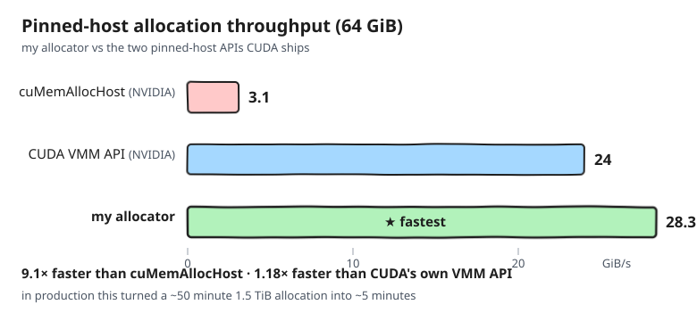
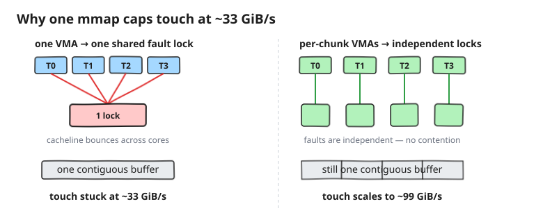
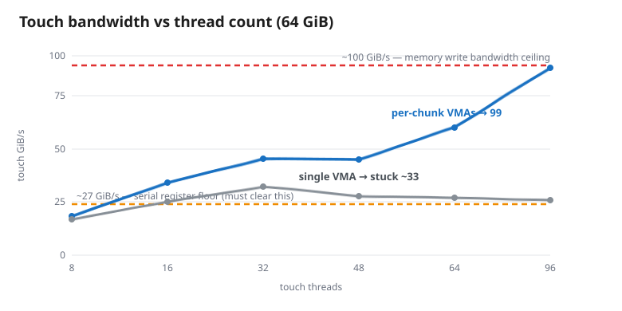
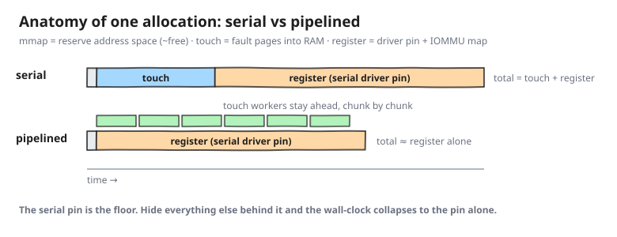
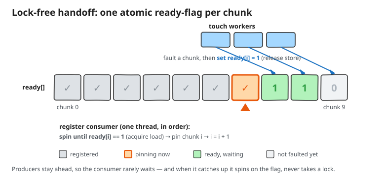
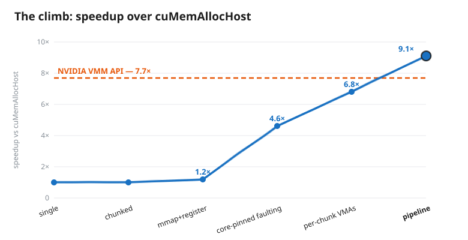

Almost nobody allocates a terabyte of pinned host memory, which is why almost
nobody notices how slow it is. Serving large language models makes you the
exception: the biggest pool of memory on the box is the host DRAM you offload
KV cache into, and to move blocks at full PCIe/NVLink speed that memory has to
be **pinned** — page-locked and mapped into the GPU's IOMMU so the copy
engines can DMA it directly. Asking CUDA's stock `cuMemAllocHost` for the
~1.5 TiB pool I wanted on an 8×B200 box takes about 50 minutes. The server
sits there, apparently hung, before it can serve a single token.

:::aside[The rig]
8× NVIDIA B200; 1.95 TiB DDR5; 192 logical CPUs (96 physical cores, SMT2)
across 2 NUMA nodes; CUDA 13.1; Linux 6.17.
:::

This is the worklog of fixing that. We'll see that the cost is per-page, so
chunking does nothing; that parallel faulting helps 4.6× until every thread
serializes on one kernel lock; that a one-line `prctl` splits that lock; and
that a serial driver lock then sets a ~28 GiB/s floor — 9× past the default,
50 minutes down to 5.

One number tracks it: **effective allocation throughput**, bytes allocated
over wall-clock. Experiments run at 64 GiB so each is quick, and the number
to beat is `cuMemAllocHost` at 3.1 GiB/s.

:::aside[Methodology]
Each configuration runs in its own fresh process that allocates, frees, and
exits, so warm allocator and driver state never leak between runs.
:::

## Step 0: where does the time actually go?

A single `cuMemAllocHost` of 499 GiB runs at 2.8 GiB/s. We can't read the
call — it's closed source — but what it must do per 4 KB page is no secret:
allocate the page, zero it, fault it into RAM, page-lock it, and map it into
the GPU's IOMMU. That work is proportional to bytes, and most of it is
per-page kernel work on a single thread.

The cheapest hypothesis is that one giant call is pathological and splitting
it up will help, so we test that first.

## Step 1: chunking

Replace the one big call with N smaller `cuMemAllocHost` calls in a loop. If
the cost were super-linear in call size, this would win.

It doesn't. Throughput is flat at ~3.1 GiB/s from 8 MiB chunks all the way to
32 GiB chunks. The cost isn't per-call; it's per-page, and chunking doesn't
change how many pages there are. To go faster we have to attack the per-page
work itself — which means getting it out of a closed-source call we can't
modify.

:::aside[Tiny chunks]
At the small end the loop is slightly *worse* than one big call — per-call
overhead starts to show.
:::

:::aside[The question that started this]
"Why is `cuMemAllocHost(1 TB)` so much slower than 10×100 GB?" It isn't, at
sizes well below RAM — both run at ~3 GiB/s. The 50-minute cliff is a
near-full-RAM memory-pressure effect, not call granularity.
:::

## Step 2: `mmap`

Can we do the per-page work ourselves? Partly. CUDA will pin memory you
allocated yourself: `mmap` an anonymous region, then hand it to
`cuMemHostRegister`, which page-locks it and maps it into the IOMMU. The
black box becomes three phases you can time separately:

- `mmap` is ~free — it only reserves virtual address space; no pages yet.
- Faulting the pages in is the wall: ~15 s per 64 GiB, or ~4.3 GiB/s.
- `cuMemHostRegister` on already-resident pages is comparatively cheap.

Serial, this recipe lands at 3.75 GiB/s — barely past the baseline. But the
expensive part is now *our* code, a plain loop of page faults, and page
faults are embarrassingly parallel.

## Step 3: parallel page faulting

Faulting a page means writing one byte to it so the kernel commits it, and no
page's fault depends on any other's, so spread the pages across worker
threads. What's the ceiling? Each first touch makes the kernel zero 4 KB of
DRAM, so the limit is DRAM write bandwidth — about 100 GiB/s on this box.
That's the target. (The zeroing is mandatory, so the way to stop paying for
it is to pool the allocation: fault the pages once and reuse the buffer,
which is what a long-lived KV-cache pool does anyway.)

:::aside[Why pages arrive zeroed]
A fresh anonymous page could otherwise hand you physical DRAM that last held
another process's secrets, so Linux zero-fills on first touch. The knob that
skips it, `mmap(MAP_UNINITIALIZED)`, is compiled out of general-purpose
kernels — `CONFIG_MMAP_ALLOW_UNINITIALIZED` exists for trusted embedded
builds only. On a server you don't get to opt out.
:::

Except the scheduler gets a vote. Left alone, it stacks workers onto the same
cores and migrates them mid-fault, and throughput caps at ~4.3 GiB/s — no
better than Step 2's serial loop. Pinning each worker to its own logical CPU
with `sched_setaffinity` is what makes threads add up:

| threads | touch GiB/s |
|--------:|------------:|
| 1       | 2.7         |
| 2       | 5.1         |
| 4       | 9.9         |
| 8       | 19.2        |
| 16      | 33.0        |
| 32      | 28.4        |
| 64      | 30.8        |

Core-pinned parallel faulting takes touch to 33 GiB/s and end-to-end
allocation to 14.2 GiB/s, 4.6× over the baseline. Core pinning is
non-negotiable; it's in the default.

But the table stalls. Past 16 threads touch sits at roughly a third of the
DRAM ceiling no matter how many threads we add — I aimed for 100 and hit 33.
Something is serializing the faults.

## Step 4: per-VMA fault lock

So what's serializing the faults? On Linux, every page fault takes a lock on
the **VMA** — the virtual memory area, the kernel's bookkeeping object for
one contiguous span of virtual address space that shares the same permissions
and backing. One `mmap` produces one VMA. Our whole buffer is one `mmap`, so
every worker, on every fault, contends for the same lock, bouncing one
cacheline across all the cores.

:::aside[VMA internals]
The kernel keeps a process's VMAs in a per-process tree. The page-fault
handler walks that tree — and locks the VMA it lands on — to find the mapping
covering the faulting address.
:::

The fix is one VMA per worker, so faults take independent locks. The catch is
contiguity: the KV-cache consumer wants one linear buffer, and the obvious
routes to separate VMAs — N separate `mmap`s, or `PROT_NONE` guard pages
between chunks — leave holes in the address range.

One `prctl` gives both. `mmap` one contiguous region, then use
`prctl(PR_SET_VMA_ANON_NAME)` to give each chunk a distinct name. The kernel
refuses to merge adjacent VMAs with different names, so you get N perfectly
adjacent VMAs — N independent fault locks, no guard holes, one linear buffer.

| threads | single VMA | per-chunk VMA |
|--------:|-----------:|--------------:|
| 8       | 19.1       | 20.4          |
| 16      | 28.0       | 38.3          |
| 32      | 36.1       | 51.1          |
| 48      | 30.9       | 50.2          |
| 64      | 30.1       | 67.2          |
| 96      | 28.8       | 98.8          |

With per-chunk VMAs touch finally scales: the 96-thread row reads ~99 GiB/s,
the DRAM write ceiling we were aiming for.

End-to-end allocation reaches 21 GiB/s, 6.8× over the baseline.

NUMA placement — pinning each thread-block to one node so it faults its own
half of the buffer — is neutral at the 64 GiB test size but pays off at the
1.5 TiB production size, so it's on by default.

:::aside[NUMA and the lock]
A single VMA's fault lock can't be split across NUMA nodes, so node placement
did nothing until per-chunk VMAs removed the shared lock. Once it's gone,
node-local first-touch is a real win at terabyte scale.
:::

That closes out touch. The wall has moved to the register phase.

## Step 5: pipelining

How much of the wall is register now? Most of it. At 64 GiB the serial recipe
spends 0.65 s touching (99 GiB/s) and 2.37 s registering (27 GiB/s), so
`cuMemHostRegister` is 78% of the wall-clock.

And register will not parallelize. From 1 to 96 register threads it is dead
flat at ~27 GiB/s — presumably serialized on a per-process lock inside the
NVIDIA driver, which we cannot split. The move Amdahl leaves is hiding rather
than shrinking: make the touch time disappear inside the register time.

:::aside[Which lock is it this time?]
Not the kernel's `mmap_lock` — that one parallelizes for touch, as Step 4
showed. The driver is closed source, so "per-process lock" is an inference
from the flat 1→96 curve, not a symbol I can point at.
:::

So instead of "touch everything, then register everything," overlap them:
touch workers produce finished chunks; a single register thread consumes them
in order. Touch outruns register, so register starts on the first ready chunk
and runs back-to-back to the end — the entire touch phase disappears behind
it.

The handoff is a lock-free ready flag per chunk. Two placement details
mattered more than the queue itself:

:::aside[The queue]
Producers publish each finished chunk with a release store; the consumer
takes them in order with an acquire load and a brief `PAUSE` spin. That's all
of it.
:::

1. The register consumer gets a dedicated physical core, not a hyperthread
   sibling of a touch worker. Sharing a core's execution units with a toucher
   drops the pipeline from ~28.3 to ~23.5 GiB/s.
2. Fewer touch threads, not more. Touch only has to stay ahead of a
   ~27 GiB/s consumer: 16 pinned touchers (~38 GiB/s) clear that bar, and
   every toucher beyond it steals core time and DRAM bandwidth from the
   register thread — at 48 touchers the pipeline drops to 24.6 GiB/s.

The pipeline lands at 28.3 GiB/s, slightly past the contended ~27 register
floor, because register now runs uncontended on its own core — the
register-bound limit Amdahl predicts, and then a little more. What's left is
to check it holds at production size.

## Where I landed

The final recipe: `mmap` the buffer; fault it in with core-pinned workers
over per-chunk, name-split, perfectly adjacent VMAs; pipeline the finished
chunks into one serial `cuMemHostRegister` on its own physical core.

:::aside[Defaults]
16 touch workers, 4096 chunks, NUMA placement on.
:::

It holds at scale: the production 1.5 TiB allocation that took ~50 minutes
now completes in ~5, with no near-full-RAM collapse.

:::aside[The code]
The production version is in Modular's
[host KV-cache allocation commit](https://github.com/modular/modular/commit/5a5e46bbac39e0a6b2efcf39b8b5cb75800703e1).
:::

There's a fairer yardstick than `cuMemAllocHost`: CUDA's modern VMM API
(`cuMemCreate` + `cuMemMap` + `cuMemSetAccess`), which *does* parallelize out
of the box and supports explicit `HOST_NUMA` placement. It's genuinely good.
It also tops out at ~24 GiB/s, in the same IOMMU-bound class as everything
else on this host.

:::aside[VMM scaling]
From 6.2 GiB/s single-threaded to ~24 GiB/s at 192 threads.
:::

The pipeline's 28.3 GiB/s is 18% past NVIDIA's best official path and 9.1×
past the common one. The serial driver pin is the floor on this host; no API
or amount of threading I tried beats it.

One lever went untried: 2 MB hugepages. The remaining cost is per-4 KB-page
work — PTE walks and IOMMU programming — and hugepages mean 512× fewer
pages, cutting both touch and, more importantly, the serial register floor
itself. I skipped them for an operational reason: these servers run in
Kubernetes, and the runners expose only a small shared hugepage pool —
nowhere near a multi-TiB pinned region. If your deployment can guarantee a
large pool, that's the most promising way past the driver floor.

:::aside[Hugepages in practice]
The Kubernetes runners here expose ~40 GB of 2 MB hugepages from a shared
pool. Transparent-hugepage-backed pinning measured "about the same" as
4 KB pages.
:::

## Conclusion

Two numbers are worth carrying out of this log: allocation went from 3.1 to
28.3 GiB/s, and production startup from about 50 minutes to about 5. The gain
came from three moves — do the faulting yourself in parallel, split the
per-VMA fault lock with a rename, and hide touch behind the one serial pin
the driver imposes.

Hugepages remain the untested way past the floor: fewer pages should shrink
even the serial register step, but I never had a pool big enough to verify
that, so treat it as a prediction rather than a result.

Thanks to Modular for giving me the room to follow "why is this syscall
slow?" all the way to the bottom. If you find yourself staring at a
multi-terabyte allocation that takes longer than your coffee break — I hope
this saved you a few of those.
